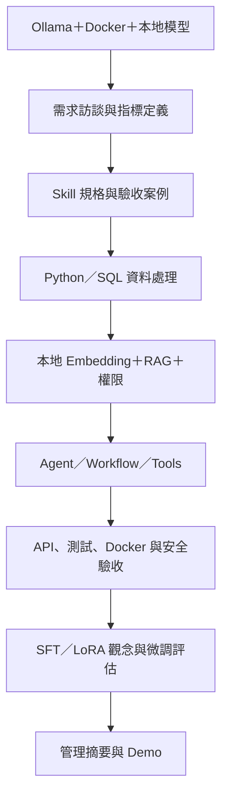

# 上工前一週複習指南：企業 AI Skill／Agent／RAG 與經管分析

> 適用工作：將金融財務、經營管理、人資與製造資料，轉化為可版本控管、可測試、可重複使用的 AI Skill，並整合 Agent、Workflow、RAG、Prompt、MCP、Function Calling、API 與企業資料庫。
>
> 版本：2026-09-07｜建議投入：每天 3～4 小時，共 7 天

## 0. 這一週要達成什麼

這不是「七天學完所有框架」，而是用一個小型專案重新串起上工後最可能用到的完整流程：



七天結束時，你應該能：

- 把主管的一句模糊問題，拆成資料來源、指標口徑、商業規則、例外情境、權限與驗收條件。
- 用 Python／pandas 與 SQL 做跨單位比較、跨期間比較、趨勢、異常與問題明細追查。
- 寫出一份結構完整、可版本控管、可測試的 AI Skill 規格。
- 建立一個小型 RAG，回答時附來源，資料不足時明確拒答，不自行補數字。
- 把查詢、計算與文件檢索封裝成結構化 Tool，再由 Workflow／Agent 調用。
- 使用 Ollama 提供地端模型推論；知道模型下載、模型推論、微調與模型匯入是不同階段。
- 能說明 Modelfile 的 SYSTEM／參數設定與微調模型權重的差異。
- 用測試證明數字、Schema、權限、資料去向與例外處理符合規格。
- 以 Git 保存版本、以 Docker 啟動服務，並完成 GPU、持久化、重啟與網路限制檢查。
- 能說明 SFT、PEFT／LoRA／QLoRA 的基本流程，並知道什麼情境不應靠微調解決。

## 1. 本指南依據的職務內容

主要依據專案內兩份原始資料：

1. `工作內容_更新版本.docx`
2. `工作介紹_協理.docx`

從文件整理出的工作主軸如下：

| 工作主軸 | 上工後可能交付的成果 | 本週安排 |
| --- | --- | --- |
| 需求訪談與規則轉譯 | 訪談紀錄、指標字典、Skill 規格、驗收案例 | Day 1、Day 3 |
| 經管資料分析 | KPI 表、差異分析、趨勢、異常與問題明細 | Day 2 |
| 管理會議報告自動化 | 摘要、圖表、風險說明、簡報草稿 | Day 2、Day 7 |
| RAG 與企業知識查詢 | 可追溯答案、引用來源、歷史明細檢索 | Day 4 |
| Agent／Workflow／Tool 整合 | Tool Schema、流程控制、API、MCP | Day 3、Day 5 |
| 企業落地與交付 | 測試、Git、Docker、權限、安全、稽核與地端模型運維 | Day 1、Day 7 |
| 製造情境理解 | 酸鹼值、銅厚、AOI 缺陷等資料分析觀念 | Day 2 延伸題 |

## 2. 本週共用實作專案

### 專案名稱

`management-review-agent`：營運管理會議 AI 助理

### 情境

使用「完全虛構的資料」，模擬主管詢問：

> 本月哪一個廠／部門的營收、成本、離職率或材料耗損最異常？和上月、去年同期及預算相比差多少？請指出明細來源、可能原因、風險與下一步應查證事項。

### 建議的虛構資料

- `monthly_kpi.csv`：月份、廠別、部門、營收、成本、預算、材料投入、材料耗損、期初人數、期末人數、離職人數。
- `incident.csv`：日期、廠別、類型、嚴重度、說明、處理狀態。
- `kpi_dictionary.md`：每項指標的定義、公式、單位、更新頻率、資料負責人。
- `management_policy.md`：異常門檻、報告格式、例外規則與權限說明。

### 至少回答 6 個問題

1. 各廠本月營收與預算差異為何？
2. 哪個廠的成本率較上月與去年同期上升最多？
3. 離職率最高的部門是哪一個？其計算分母是否完整？
4. 材料耗損率是否超過制度門檻？
5. 異常 KPI 是否能追到相關事件明細？
6. 若文件或資料不足，系統是否能說明缺少什麼，而不是猜答案？

### 不可妥協的設計原則

- 所有數值先由 SQL／Python 計算，LLM 只負責理解問題、選工具與組織文字。
- 每個數字都要能追溯到資料表、查詢條件、期間、單位與計算公式。
- 「事實」、「規則判定」和「可能原因」分開；可能原因不得寫成已確認事實。
- 不使用真實公司、財務、人資或產線敏感資料做上工前練習。
- Tool 預設唯讀；任何寫入、寄送或對外發布動作都需要人工確認。
- 生成模型與 Embedding 優先使用地端服務；若使用 OpenAI-compatible API，先確認實際 endpoint 與服務端模型。
- 模型、向量索引、文件與執行紀錄的資料流向必須可追溯；本週驗收要能證明是否存在對外網路連線。
- 「下載模型」不等於「訓練模型」；微調應另外經過資料準備、訓練、評估與相容性檢查。

### 建議目錄

```text
management-review-agent/
├─ data/
│  ├─ raw/
│  └─ processed/
├─ knowledge/
│  ├─ kpi_dictionary.md
│  └─ management_policy.md
├─ skills/
│  └─ management_review/SKILL.md
├─ src/
│  ├─ analysis.py
│  ├─ retrieval.py
│  ├─ tools.py
│  ├─ workflow.py
│  └─ api.py
├─ sql/
│  └─ kpi_queries.sql
├─ tests/
├─ reports/
├─ Dockerfile
└─ README.md
```

## 3. 七天總覽

| 天數 | 主題 | 當天必交成果 | 建議時間 |
| --- | --- | --- | --- |
| Day 1 | Ollama＋Docker、本地模型、GPU、網路限制 | Python 成功呼叫地端模型、模型版本／狀態紀錄、地端安全檢查 | 3～4 小時 |
| Day 2 | 需求訪談、指標口徑、Python／SQL | 一項 KPI 的可追溯分析、資料品質檢查 | 3～4 小時 |
| Day 3 | Prompt、Skill、JSON Schema、Tool Calling | 一個受限查詢工具與驗證測試 | 3～4 小時 |
| Day 4 | 本地 embedding、RAG、版本與權限過濾 | 有引用、能拒答的文件問答 | 3～4 小時 |
| Day 5 | Workflow／Agent、API、MCP 基本概念 | 查數據＋查制度＋產生摘要的端到端流程 | 3～4 小時 |
| Day 6 | SFT、LoRA／QLoRA、資料切分、微調評估與匯入 | 微調流程與相容性檢查表；實際訓練列延伸 | 3～4 小時 |
| Day 7 | 斷外網演練、越權與失敗測試、效能、Demo | 可重現的地端小型專案、驗收與上工提問清單 | 3～4 小時 |

若每天只有 2 小時，只做標示為「必做」的內容；若有 5 小時，再做「延伸」。每天最後保留 15 分鐘，不看資料用自己的話口述當天內容。

---

## Day 1｜先把「地端模型」跑通，再理解工作規格

### 今日目標

- 知道下載模型、推論、微調與匯入是不同階段。
- 用 Ollama 在本機成功呼叫模型，確認模型名稱、版本／digest、服務狀態與 GPU 使用情況。
- 了解 Docker 的角色：提供服務執行環境，不等於完成訓練。
- 建立最基本的網路、持久化與資料去向驗收。
- 再把主管問題拆成需求、KPI、資料、規則、權限與驗收條件。

### 先記住四個階段

| 階段 | 目的 | 本週要掌握 |
| --- | --- | --- |
| 下載模型 | 取得既有模型權重 | 不等於訓練 |
| 推論 | 用既有模型回答問題 | Ollama／Python API |
| 微調 | 用資料更新模型行為／權重 | Day 6 的 SFT／LoRA／QLoRA |
| 匯入與部署 | 把模型／adapter 放入可運行服務 | 必須確認基底模型與架構相容 |

`Modelfile` 的 `SYSTEM` 提示詞屬於執行時設定，不等於修改模型權重。

### 時間配置

1. **45 分鐘｜Ollama＋Docker 基本操作**
   - 啟動 Ollama，確認本地 API 與模型清單。
   - 用 Python 呼叫 `localhost:11434`。
   - 記錄模型名稱、版本／digest、context length 與量化資訊（若可取得）。
   - Docker 若承載 Ollama／應用，確認 GPU、volume、restart 與 port publishing。
2. **30 分鐘｜地端與雲端邊界**
   - 確認實際 endpoint。
   - 了解 `OLLAMA_NO_CLOUD=1` 的用途，重新啟動後驗證設定。
   - 檢查整個應用而不只是 Ollama 是否仍有對外連線。
3. **30 分鐘｜模型生命週期**
   - 下載模型 ≠ 訓練。
   - 推論 ≠ 微調。
   - `Modelfile` ≠ 權重微調。
4. **60 分鐘｜需求訪談與指標規格**
5. **30 分鐘｜必做：Skill v0.1 與驗收案例**
6. **15 分鐘｜口述複習**

### 必做成果

- `local_model_checklist.md`：模型、endpoint、版本／digest、GPU、Docker、port、volume、網路、雲端開關。
- `problem_statement.md`：使用者、決策、現況痛點、輸入、輸出、不在範圍內的項目。
- `kpi_dictionary.md`：至少 5 個 KPI；每個都有定義、公式、單位、時間粒度、來源與負責人。
- `skills/management_review/SKILL.md`：依附錄模板完成 v0.1。
- `acceptance_cases.md`：至少包含正常、缺值、零分母、資料延遲、權限不足、查無證據六種案例。

### 地端驗收最小項目

- [ ] Python 能呼叫本地模型並得到可解析回應。
- [ ] 確認實際推論 endpoint 與模型，而不是只看到「OpenAI-compatible」就判定為 OpenAI 雲端。
- [ ] 能辨識模型版本／digest，並把它寫進執行紀錄。
- [ ] 能確認 GPU 是否真的被使用。
- [ ] Docker 中的模型與向量索引採持久化儲存，容器重啟後必要狀態仍存在。
- [ ] `11434` 不應無限制暴露給外部網路；按公司環境限制介面與存取權。
- [ ] 若公司要求完全離線，驗收要包含停用 Ollama cloud 與確認其他套件／應用沒有外傳資料。

### 完成判定

- [ ] 另一個人拿到 checklist，可以重現模型啟動與基本驗收。
- [ ] 能用一句話區分「下載模型、推論、微調、匯入」。
- [ ] 能說明 Docker 在這條鏈上的角色。
- [ ] 能說出至少一個模型資料流向與網路驗收方法。

### 口頭自測

1. 為什麼 `Modelfile` 的 `SYSTEM` 不等於微調？
2. `localhost:11434` 為什麼不能單獨證明「完全離線」？
3. Docker 裡刪掉 container 後，哪些模型／索引狀態應透過 volume 保留下來？
4. 下載一個既有模型後，下一步怎麼證明「真的用了它」？


## Day 2｜用 Python／SQL 產出可信的經管分析

### 今日目標

- 熟練 `merge`、`groupby`、`pivot`、缺值處理、日期處理與資料型別。
- 用 SQL 完成 JOIN、CTE、聚合與 Window Function。
- 把異常數字連回明細，不只輸出一段看似合理的摘要。

### 時間配置

1. **45 分鐘｜pandas 快速複習**
   - 型別、缺值、重複值、主鍵唯一性。
   - `merge(..., validate=...)`、`groupby`、`pivot_table`、`pct_change`、rolling window。
2. **45 分鐘｜SQL 快速複習**
   - JOIN、GROUP BY、CASE、COALESCE、CTE。
   - `LAG`、`ROW_NUMBER`、移動平均、同月跨廠排名。
   - 先建立完整期間骨架；月份缺漏時，不可把 `LAG` 的上一列直接當成「上個月」。
3. **120 分鐘｜必做：分析虛構資料**
4. **30 分鐘｜核對與圖表**
5. **15 分鐘｜口述複習**

### 必做分析

- 水平比較：相同月份，不同廠／部門的 KPI 比較與排名。
- 垂直比較：同一廠的月增率、年增率與最近 3 個月趨勢。
- 預算差異：`actual - budget`，以及差異率；先確認 budget 對應的是哪個指標、期間與版本。
- 異常辨識：先用業務門檻，再用 IQR／z-score／Isolation Forest 作輔助。
- 問題明細：每筆異常輸出其資料來源、篩選條件與相關事件。
- 期間比較：本月／上月／去年同期前，先確認每個期間是否實際存在且資料狀態一致。
- 粒度檢查：營收、成本、人數、預算若來自不同粒度，先分別聚合後再合併，避免重複加總。

### 計算時必須處理

- 基準值為 0：差異率回傳空值並加上 `zero_denominator` 標記，不回傳無限大。
- 缺值：區分「確定為 0」與「未知／尚未入帳」。
- 幣別、單位與時間粒度：不可直接混算。
- 尚未關帳的月份：標記資料狀態，避免和完整月份直接比較。
- 多對多 JOIN：先驗證主鍵，避免金額被重複放大。

### 建議輸出欄位

`metric_name`、`entity`、`period`、`actual`、`baseline`、`variance`、`variance_pct`、`unit`、`threshold`、`status`、`source`、`query_id`、`data_as_of`、`evidence_rows`。

### 完成判定

- [ ] Python 與 SQL 對至少 3 個核心 KPI 算出相同結果。
- [ ] 所有異常都能追到原始列或事件明細。
- [ ] 至少有 5 個資料品質檢查，且故意製造錯誤時會失敗。
- [ ] 圖表標示單位、期間、資料更新時間與基準線。

### 延伸：製造情境

以虛構資料模擬酸鹼值、銅厚或 AOI 缺陷率：先用工程規格上下限判斷，再比較統計異常。說明「超出規格」與「偏離歷史分布」為何不是同一件事。

---

## Day 3｜把 Prompt、Schema 與 Tool 做成可測試的 Skill

### 今日目標

- 讓 Skill 不只是提示詞，而是包含合約、規則、權限與測試的可維護元件。
- 以明確 Schema 約束輸入與輸出。
- 把決定性計算放在程式／SQL，把語言模型放在適合的位置。

### 時間配置

1. **45 分鐘｜複習結構化輸出與 Function Calling**
2. **45 分鐘｜設計 Input／Output Schema**
3. **90 分鐘｜必做：實作 3 個唯讀 Tool**
4. **45 分鐘｜測試正常與例外情境**
5. **15 分鐘｜口述複習**

### 建議的 3 個 Tool

1. `get_kpi_comparison`
   - 輸入：指標、實體、期間、比較基準。
   - 輸出：計算結果、單位、資料時間、查詢 ID、警告。
2. `retrieve_policy`
   - 輸入：查詢文字、文件類型、有效日期、top_k。
   - 輸出：段落、文件名、版本、頁碼／章節、相關度。
3. `get_incident_details`
   - 輸入：廠別、期間、事件類型、嚴重度。
   - 輸出：結構化事件清單與來源。

不要提供可由模型自由輸入任意 SQL 的工具。應讓 Tool 接受受限參數，再由後端產生參數化查詢。

### 權限來源必須可信

Skill 的 `requester_role` 可以存在於輸入 Schema 作為後端驗證後的上下文，但不能相信使用者或模型自行填入的角色。實作時應：

- 角色與資料範圍由後端認證／授權系統取得。
- 每次 Tool／資料查詢重新檢查權限。
- 未授權內容不可先交給模型，再期待模型自行隱藏。
- `SKILL.md` 是規格與指令載體，不是放進目錄後就會自動執行；仍需實作規格載入、Tool 註冊、流程控制與驗證。

### Prompt 結構

1. **角色與目標**：服務哪一類使用者、協助哪種決策。
2. **可用資料與工具**：何時調用、哪些不可用。
3. **不變規則**：數字不可心算、不得省略單位、不得把假設寫成事實。
4. **資料不足行為**：指出缺少欄位／期間／權限，並停止下結論。
5. **輸出 Schema**：摘要、異常表、證據、假設、風險、下一步。
6. **少量範例**：至少一個正常例、一個拒答案例。

### 必做測試（至少 10 個）

- 正常單一 KPI 查詢。
- 多廠水平比較。
- 月增與年增比較。
- 缺資料。
- 基準為 0。
- 指標名稱不存在。
- 期間格式錯誤。
- 無權限查看人資明細。
- 文件內容與資料表互相矛盾。
- 使用者要求忽略規則或輸出敏感資料。

### 完成判定

- [ ] Schema 驗證會攔下錯誤輸入與不完整輸出。
- [ ] Tool 錯誤有穩定、可辨識的錯誤碼，不把 stack trace 直接交給使用者。
- [ ] 同一組資料重跑，數值結果一致。
- [ ] Prompt 改版有版本號，測試可比較改版前後結果。

---

## Day 4｜RAG：找到正確資料、附上證據、知道何時不能回答

### 今日目標

- 理解 RAG 的資料匯入、切塊、metadata、embedding、檢索、重排、生成與評估。
- 知道向量檢索不是完整解法；結構化數值仍應查資料庫。
- 建立可測試的「有來源回答」和「證據不足拒答」。

### 時間配置

1. **45 分鐘｜畫出 RAG 流程與失敗點**
2. **60 分鐘｜建立小型知識庫**
3. **75 分鐘｜必做：檢索＋回答＋引用**
4. **45 分鐘｜建立 15 題評估集**
5. **15 分鐘｜口述複習**

### 必做設計

- 生成模型與 Embedding 優先使用本地服務；不要直接把公司資料照搬進外部模型／追蹤服務。
- 若使用 OpenAI-compatible API，先確認 endpoint 指向本地 Ollama 或公司核准的內部服務。
- 文件切塊時保留：`document_id`、標題、章節、版本、生效日、權限標籤。
- 查詢先判斷是「結構化數值問題」還是「制度／文字問題」。
  - 數值問題走 SQL／API Tool。
  - 制度問題走文件檢索。
  - 混合問題分別取證後再合併。
- 回答中的每個重要結論都附來源；找不到足夠來源時，回答「目前資料不足」，並說明缺什麼。
- 舊版與新版制度同時存在時，依查詢日期選擇有效版本。

### 15 題評估集至少涵蓋

- 5 題可直接從單一文件回答。
- 3 題需跨兩份文件整合。
- 3 題需 SQL 與文件混合取證。
- 2 題刻意沒有答案，應拒答。
- 2 題包含惡意或矛盾指令，仍須遵守系統規則。

### 最小評估表

| 評估類型 | 分母 | 問法 | 本週練習門檻 |
| --- | ---: | --- | --- |
| Retrieval hit | 有標準證據的題目 | 正確證據是否出現在 top-k | 只對可回答題目計算 |
| Evidence completeness | 有標準證據的題目 | 支持結論所需的證據是否齊全 | 逐題檢查 |
| Answer correctness | 所有應回答題目 | 關鍵事實與標準答案是否一致 | ≥ 12／可回答題數 |
| Citation support | 所有有引用的答案 | 引用內容是否真的支持結論 | 100% |
| Abstention | 無答案題 | 無答案時是否明確拒答 | 2／2 |
| Authorization | 越權題 | 是否拒絕未授權資料 | 100% |
| Structured output | 適用輸出 | 是否通過 Schema 驗證 | 100% |

這些是本週練習門檻，不是正式產品 SLA；正式目標應由業務風險與驗收需求決定。

### 完成判定

- [ ] 能重現至少一個「檢索到錯段落」的失敗案例並改善。
- [ ] 能說明 chunk size、top-k、metadata filter 各自造成的取捨。
- [ ] 答案引用可追到文件與章節，而不是只顯示模糊的「資料來源」。
- [ ] 文件中的提示注入文字不會改寫系統規則或觸發危險 Tool。

---

## Day 5｜Agent、Workflow、Function Calling 與 MCP 整合

### 今日目標

- 知道何時應用固定 Workflow，何時才需要 Agent 動態選工具。
- 能解釋 Model、Prompt、Skill、Tool、Resource、Workflow 與 Agent 的邊界。
- 完成一條可執行、可觀察、可中止的端到端流程。

### 先做判斷

| 情境 | 優先選擇 |
| --- | --- |
| 固定月報、步驟穩定、法遵要求高 | Deterministic Workflow |
| 問題類型多、需依內容選不同查詢工具 | Agent＋受限 Tool |
| 純文件問答 | Retriever／RAG，不一定需要 Agent |
| 只需固定格式改寫 | Prompt＋Schema，不一定需要 Tool |
| 要讓多個 AI Client 共用企業工具與資料 | 評估使用 MCP |

### 時間配置

1. **45 分鐘｜複習 Agent loop 與 Workflow 狀態**
2. **45 分鐘｜理解 MCP 的 Host／Client／Server 與 Tools／Resources／Prompts**
3. **120 分鐘｜必做：串接端到端流程**
4. **30 分鐘｜錯誤、timeout、retry 與停止條件**
5. **15 分鐘｜口述複習**

### 建議流程

1. 驗證使用者、期間與權限。
2. 將問題分類為數值、制度或混合問題。
3. 規劃受限 Tool 呼叫。
4. 執行查詢並保存 query／document evidence。
5. 驗證 Tool 輸出 Schema 與資料新鮮度。
6. 生成摘要，分開列出事實、異常、假設與下一步。
7. 執行引用、敏感資訊與格式檢查。
8. 回傳答案及 trace ID。

### MCP 對應練習

- **Resources**：KPI 字典、制度文件、資料表 Schema 等唯讀脈絡。
- **Tools**：受限的 KPI 查詢、事件查詢、圖表產生器。
- **Prompts**：管理月報、異常說明、會議問答等使用者主動選用模板。

### 框架策略

一週內不要同時深入 LangChain、LlamaIndex、Langflow、Semantic Kernel。先用純 Python 把資料、Tool 合約與測試做對，再選一個框架完成整合：

- Python 為主且重視 agent orchestration：可選 LangChain／LangGraph。
- 以企業文件、索引與 query engine 為主：可選 LlamaIndex。
- Microsoft／.NET 生態：可選 Semantic Kernel 或團隊指定框架。
- 需要快速視覺化 POC：可用 Langflow，但核心規則與測試仍應保留在程式與版本庫。

### 完成判定

- [ ] 能在 log 中看出模型為何選某個 Tool、傳入什麼受限參數、Tool 回傳什麼。
- [ ] Tool timeout、回傳空值或 Schema 錯誤時，流程能安全結束或降級。
- [ ] 同一個查詢不會因 retry 造成重複寫入；本週 Tool 原則上全部唯讀。
- [ ] 能在白板上用 2 分鐘說清楚 MCP 與 Function Calling 的關係和差異。

---

## Day 6｜理解 SFT／LoRA／QLoRA，並把微調與推論分開

### 今日目標

- 理解「模型下載 → 微調 → 評估 → 匯入／部署」的完整生命週期。
- 知道 TRL＋PEFT／LoRA 是可能的微調工具組合，但公司實際採用框架仍需確認。
- 能判斷哪些需求應靠 RAG／Tool，而不是靠重新訓練模型。
- 完成一份微調資料切分、評估與相容性檢查表；實際訓練列為延伸。

### 時間配置

1. **45 分鐘｜SFT／PEFT／LoRA／QLoRA 概念**
2. **45 分鐘｜資料集設計與 train／validation／test 切分**
3. **60 分鐘｜微調評估與回歸測試設計**
4. **45 分鐘｜模型匯入 Ollama／相容性檢查**
5. **30 分鐘｜Git／Docker 整理與 README**
6. **15 分鐘｜口述複習**

### 先建立正確心智模型

- **模型下載**：取得既有權重，不是訓練。
- **SFT**：以範例資料調整模型行為。
- **LoRA／QLoRA**：降低微調參數與資源成本的方法；是否採用由公司模型與硬體條件決定。
- **Ollama**：偏向模型執行／服務與匯入相容模型，不是通用訓練框架。
- **Docker**：封裝執行環境；把模型放進 container 不代表完成訓練。

### 微調判斷題

| 需求 | 優先方法 |
| --- | --- |
| 公司制度每天更新 | RAG／文件版本與權限 |
| 即時營收、人數、成本 | SQL／Tool |
| 固定輸出格式 | Prompt＋Schema |
| 模型需要學會固定任務格式／風格 | 可評估 SFT／LoRA |
| 新增一批事實知識 | 優先 RAG，不先微調 |
| 權限控制 | 後端授權，不靠微調 |

### 必做成果

- `finetuning_checklist.md`
  - 基底模型名稱／版本。
  - 訓練資料來源、授權、清理規則。
  - train／validation／test 切分。
  - 超參數與硬體需求。
  - baseline 與 fine-tuned 評估。
  - hallucination、格式、拒答與安全測試。
  - 與 base model 的 regression diff。
  - 匯入 Ollama 前的架構／adapter 相容性檢查。
- 一頁「微調是否真的必要」決策表。

### 完成判定

- [ ] 能區分模型權重更新、Prompt 設定、RAG 知識與 Tool 資料。
- [ ] 能說明為什麼公司數字更新通常不該靠微調。
- [ ] 能列出至少一個 baseline 與 fine-tuned model 的比較指標。
- [ ] 能說明匯入模型／adapter 前為何要確認基底模型與架構相容。
- [ ] 實際訓練不是必要前置條件；若公司未指定工具與資料，先完成流程與評估設計。

### Git／Docker 完成判定

- [ ] `README.md` 從零說明安裝、環境變數、啟動、測試與範例問題。
- [ ] secrets 不進 Git；提供 `.env.example`，其中沒有真實金鑰。
- [ ] `docker build` 成功，必要模型／索引狀態透過 volume 等持久化儲存保留。
- [ ] 服務重啟後，不需重新下載所有必要模型／索引即可恢復。


## Day 7｜斷外網、越權、失敗演練與成果 Demo

### 今日目標

- 完成一次「沒有外網／禁止雲端模型」情境下的驗收。
- 驗證權限、提示注入、Tool timeout、錯誤輸出與資料外傳風險。
- 在時間壓力下完整展示「問題 → 證據 → 分析 → 報告」。

### 時間配置

1. **45 分鐘｜整理並跑完所有測試**
2. **60 分鐘｜必做：斷外網／地端模型／越權演練**
3. **45 分鐘｜必做：三個端到端情境**
4. **45 分鐘｜準備 10 分鐘 Demo**
5. **30 分鐘｜整理上工提問清單與個人弱項**

### 斷外網驗收

- [ ] 停用 Ollama cloud 功能並重新啟動服務，再驗證設定。
- [ ] 在網路受限環境執行一次完整查詢，確認本地模型仍可工作。
- [ ] 檢查應用程式、Embedding、RAG、觀測／追蹤套件是否有對外連線。
- [ ] 確認 Docker port 僅發布到必要介面／網段，不把 `11434` 無限制暴露。
- [ ] 確認模型與向量索引從持久化儲存恢復。
- [ ] 「是否完全離線」仍需由公司確認，不能自行假設。

### 威脅與控制

| 風險 | 最小控制 |
| --- | --- |
| 文件內提示注入 | 文件視為不可信資料；指令與資料分離；Tool allowlist |
| 財務／人資資訊外洩 | 欄列權限、遮罩、最小化輸出、log 脫敏 |
| 任意 SQL 或越權查詢 | 唯讀 DB 帳號、參數化查詢、固定查詢模板、資料範圍檢查 |
| LLM 幻覺與錯誤歸因 | 程式計算、引用、拒答、假設標記、人工覆核 |
| 過度自主行動 | 寫入／寄送／發布前人工批准；限制工具與最大步數 |
| 惡意或無效 Tool 輸出 | Schema 驗證、內容清理、錯誤隔離、timeout |
| 版本更動造成品質退化 | 固定評估集、版本號、回歸測試與可回滾版本 |

### 可觀測性至少記錄

- trace ID、Skill／Prompt 版本、模型與參數。
- 使用者角色與允許的資料範圍；不記錄不必要的敏感原文。
- Tool 名稱、受限參數、執行時間、錯誤碼與資料更新時間。
- 使用的文件版本與片段 ID。
- 最終 Schema 驗證、引用檢查與人工批准狀態。

### 三個必演練情境

1. **正常情境**：資料完整，找出異常並附來源。
2. **資料不足情境**：某廠尚未關帳或缺少分母；系統停止不可靠比較並說明缺口。
3. **安全情境**：使用者要求看無權限人資明細，或文件包含「忽略規則」文字；系統拒絕越權且不觸發危險工具。

### 10 分鐘 Demo 腳本

- 1 分鐘：業務問題與目前人工痛點。
- 2 分鐘：架構、資料流與哪些步驟是決定性計算。
- 3 分鐘：現場輸入一題，展示 Tool、證據、分析與報告。
- 2 分鐘：展示一個失敗案例及系統如何安全處理。
- 1 分鐘：評估結果與已知限制。
- 1 分鐘：若進入正式環境，下一步需要哪些資料、權限與驗收決策。

### 最終交付清單

- [ ] 一頁需求與範圍。
- [ ] KPI／資料字典。
- [ ] 地端模型 checklist（模型、endpoint、GPU、網路、volume、版本）。
- [ ] Skill 規格與版本紀錄。
- [ ] Python 與 SQL 分析。
- [ ] 3 個受限 Tool 與 API／MCP 介面。
- [ ] 本地 Embedding／RAG 知識庫及 15 題評估集。
- [ ] 微調決策表與 `finetuning_checklist.md`。
- [ ] 至少 10 個規則／Tool 測試，加上 3 個端到端情境。
- [ ] 管理摘要、異常表、證據與圖表。
- [ ] 威脅模型、權限說明、網路限制與已知限制。
- [ ] Dockerfile、README、Git 歷史。
- [ ] 10 分鐘 Demo。


## 4. 上工第一週建議確認的問題

不用在第一天一次問完；先問會直接影響第一個任務的問題。

### 業務與優先順序

1. 第一個要落地的是財務、經管、人資，還是製造場域？
2. 高階主管最常重複問的前 10 個問題是什麼？各問題會觸發什麼決策？
3. 目前最耗時的報表或資料整理流程是哪一個？基準工時是多少？
4. POC 成功的定義是正確率、節省時間、可追溯性、使用率，還是其他指標？

### 指標與資料

5. 是否已有正式 KPI 字典、報表口徑及資料 owner？
6. 主要資料來源是 Excel、ERP、MES、HR、財務系統、資料倉儲或其他資料庫？
7. 資料更新頻率、關帳時間、時區、幣別與歷史版本如何管理？
8. 哪些資料只能看彙總、不能看明細？是否有欄／列層級權限與脫敏規則？

### 技術與架構

9. 團隊目前採用的模型、框架、向量資料庫、Agent 平台與觀測工具是什麼？
10. 地端模型／H200 的使用範圍、網路限制、模型服務介面與資源配額為何？
11. Ollama 是否正式作為模型服務？模型如何下載、版本／digest 如何管理、誰負責升版？
12. 是否要求 `OLLAMA_NO_CLOUD=1` 或其他完全離線政策？有哪些例外的受控下載窗口？
13. RAG、資料庫查詢與 Tool／MCP 的責任邊界目前如何定義？
14. 是否已有共用 Prompt／Skill 目錄、Schema 規範、版本策略與測試框架？
15. 若有微調需求，實際使用 TRL、PEFT／LoRA、其他框架還是平台化工具？誰負責資料準備、訓練與評估？
16. 微調模型匯入 Ollama 的格式、相容性檢查與回滾流程目前怎麼做？


### 交付與協作

13. Git flow、code review、CI/CD、部署環境與 release 流程為何？
14. 誰負責業務驗收、資料驗證、安全審查與上線核准？
15. 第一個 2 週交付物的範圍、完成定義、demo 對象與日期是什麼？

## 5. 一頁速查：重要概念怎麼區分

| 概念 | 一句話定義 | 這份工作中的例子 |
| --- | --- | --- |
| Prompt | 單次或一類任務的模型指令與脈絡 | 要求輸出管理摘要的指令 |
| Skill | 可重複使用、含規則／Schema／限制／測試的能力單元 | 月度經管檢視 Skill |
| Tool | 模型可呼叫的外部函式或服務 | 查 KPI、查事件、取文件 |
| Function Calling | 模型用結構化參數要求應用程式執行 Tool | 呼叫 `get_kpi_comparison` |
| Workflow | 預先定義的步驟、狀態與分支 | 每月固定產生管理報告 |
| Agent | 依問題與狀態動態決定下一步或選 Tool 的系統 | 判斷先查 KPI 還是制度文件 |
| RAG | 生成前先取回外部知識作為證據 | 從制度與歷史說明找依據 |
| Embedding | 把內容映射成向量以支援語意相似度 | 找到用詞不同但意思相近的規範 |
| Vector DB | 儲存／搜尋向量及其 metadata | 依部門、版本、權限過濾文件 |
| MCP | AI 應用連接 Tools、Resources、Prompts 的開放協定 | 讓不同 Client 共用企業查詢能力 |
| Ollama | 地端模型執行／服務與模型匯入工具 | 提供本地模型 API；不能把它當成通用訓練框架 |
| Modelfile | Ollama 的模型／執行設定描述 | SYSTEM、參數與模型來源等設定，不等於更新權重 |
| Fine-tuning | 以訓練資料調整模型行為／能力 | 不適合作為即時更新公司數字的主要方法 |

## 6. AI Skill 規格模板

可把下列內容複製到 `skills/management_review/SKILL.md`：

```md
---
name: management-review
version: 0.1.0
owner: TBD
status: draft
description: 依指定期間與組織範圍，分析管理 KPI、異常及其可追溯證據。
---

# 1. 目標

說明服務對象、要支援的決策，以及可量化價值。

# 2. 範圍

## In scope
- ...

## Out of scope
- 不取代正式會計結帳或人工作業核准。
- 不在沒有證據時判定根因。

# 3. 輸入 Schema

- metric_names: string[]
- entities: string[]
- start_period: YYYY-MM
- end_period: YYYY-MM
- comparison: previous_period | yoy | budget
- requester_role: string  # 由後端認證／授權系統取得，不可信任使用者或模型自行填值

# 4. 輸出 Schema

- summary
- metric_results[]
- anomalies[]
- evidence[]
- hypotheses[]
- risks[]
- missing_data[]
- warnings[]
- data_as_of
- trace_id

# 5. 資料來源

列出系統／表／文件、owner、更新頻率、主鍵、版本與權限。

# 6. 商業規則與計算邏輯

逐項列出公式、單位、基準、門檻、四捨五入、幣別與期間口徑。

# 7. 流程

驗證輸入 → 檢查權限 → 查詢 → 計算 → 檢索證據 → 產生摘要 → 驗證輸出。

# 8. 例外處理

定義缺值、零分母、查無資料、資料過期、矛盾資料、Tool timeout 與權限不足。

# 9. 安全與權限

列出可見欄位／列、敏感資訊、log 脫敏、唯讀限制及需人工批准的動作。

重要：`requester_role` 只是後端驗證後的上下文，不是授權依據。每次 Tool／資料查詢都應重新檢查角色與資料範圍；未授權資料不可先交給模型。

# 10. 驗收條件

以 Given／When／Then 或 input／expected output 寫出可重跑案例。

# 11. 版本紀錄

- 0.1.0：初稿。
```

## 7. 官方學習來源與閱讀順序

以官方文件為主；先讀指定頁面並動手做，不需要從頭讀完整站點。地端實作優先確認 Ollama／Docker；框架文件用來理解概念，不代表公司一定採用同一套工具。

### Day 1：Ollama、Docker 與地端模型

- [Ollama Docker](https://docs.ollama.com/docker)
- [Ollama Tool Calling](https://docs.ollama.com/capabilities/tool-calling)
- [Ollama Structured Outputs](https://docs.ollama.com/capabilities/structured-outputs)
- [Ollama Embeddings](https://docs.ollama.com/capabilities/embeddings)
- [Ollama 模型匯入](https://docs.ollama.com/import)
- [Ollama Modelfile](https://docs.ollama.com/modelfile)
- [Ollama OpenAI compatibility](https://docs.ollama.com/api/openai-compatibility)
- [Ollama Authentication／雲端相關說明](https://docs.ollama.com/api/authentication)
- [Ollama FAQ](https://docs.ollama.com/faq)
- [Docker Port Publishing](https://docs.docker.com/engine/network/port-publishing/)
- [Docker Volumes](https://docs.docker.com/engine/storage/volumes/)

### Day 2：Schema 與 Python／SQL 分析

- [JSON Schema：Getting Started](https://json-schema.org/learn/getting-started-step-by-step)
- [FastAPI：Request Body 與 Pydantic Schema](https://fastapi.tiangolo.com/tutorial/body/)
- [pandas：10 minutes to pandas](https://pandas.pydata.org/docs/user_guide/10min.html)
- [pandas：GroupBy](https://pandas.pydata.org/docs/user_guide/groupby.html)
- [pandas：Merge／Join](https://pandas.pydata.org/docs/user_guide/merging.html)
- [pandas：Missing Data](https://pandas.pydata.org/docs/user_guide/missing_data.html)
- [PostgreSQL：Aggregate Functions](https://www.postgresql.org/docs/current/functions-aggregate.html)
- [PostgreSQL：Window Functions](https://www.postgresql.org/docs/current/tutorial-window.html)
- 延伸：[scikit-learn：Novelty and Outlier Detection](https://scikit-learn.org/stable/modules/outlier_detection.html)

### Day 3：Tool、結構化輸出與測試

- [FastAPI：Response Model](https://fastapi.tiangolo.com/tutorial/response-model/)
- [pytest：Get Started](https://docs.pytest.org/en/stable/getting-started.html)
- [pytest：Parametrize](https://docs.pytest.org/en/stable/how-to/parametrize.html)

### Day 4：RAG 與評估

- [LangChain：建立 Semantic Search](https://docs.langchain.com/oss/python/langchain/knowledge-base)
- [LangGraph：Agentic RAG 教學](https://docs.langchain.com/oss/python/langgraph/agentic-rag)
- [LangSmith：Evaluate a RAG Application](https://docs.langchain.com/langsmith/evaluate-rag-tutorial)
- [LlamaIndex：Framework Documentation](https://developers.llamaindex.ai/python/framework/)

實作原則：若官方範例使用外部模型、OpenAI Embeddings 或外部追蹤服務，不要直接把公司資料照搬出去；改成公司核准的本地／內部服務。

### Day 5：Agent、MCP 與框架比較

- [LangChain：Agents](https://docs.langchain.com/oss/python/langchain/agents)
- [MCP：Introduction](https://modelcontextprotocol.io/docs/2026-07-28/getting-started/intro)
- [MCP：Architecture](https://modelcontextprotocol.io/docs/2026-07-28/learn/architecture)
- [MCP：Tools](https://modelcontextprotocol.io/specification/2026-07-28/server/tools)
- [MCP：Resources](https://modelcontextprotocol.io/specification/2026-07-28/server/resources)
- [MCP：Prompts](https://modelcontextprotocol.io/specification/2026-07-28/server/prompts)
- [MCP：Build a Server](https://modelcontextprotocol.io/docs/2026-07-28/develop/build-server)
- 選讀：[Semantic Kernel：Function Calling](https://learn.microsoft.com/en-us/semantic-kernel/concepts/ai-services/chat-completion/function-calling/)
- 選讀：[Langflow：Documentation](https://docs.langflow.org/)

### Day 6：SFT、LoRA／QLoRA 與微調

- [TRL：SFT Trainer](https://huggingface.co/docs/trl/en/sft_trainer)
- [PEFT／LoRA 文件](https://huggingface.co/docs/peft/)
- 微調時先確認公司實際採用的訓練框架、GPU 資源、資料治理與模型授權；若尚未確認，不要自行假設工具鏈。

### Day 7：安全與企業交付

- [OWASP：Authorization Cheat Sheet](https://cheatsheetseries.owasp.org/cheatsheets/Authorization_Cheat_Sheet.html)
- [OWASP：Top 10 for LLM Applications](https://owasp.org/www-project-top-10-for-large-language-model-applications/)
- [Docker：Python Guide](https://docs.docker.com/guides/python/)
- [Pro Git：Basic Branching and Merging](https://git-scm.com/book/en/v2/Git-Branching-Basic-Branching-and-Merging)


## 8. 最後 20 分鐘閉卷檢查

不查資料，以口頭或紙筆回答：

1. 我能否從一個主管問題列出必要資料、公式、權限與驗收案例？
2. 我能否解釋水平比較、垂直比較、趨勢、異常與根因假設的差別？
3. 我能否說明為何數值計算不應交給 LLM 自由推算？
4. 我能否畫出 RAG 的完整資料流及三個常見失敗點？
5. 我能否解釋 Workflow 與 Agent 的選擇條件？
6. 我能否解釋 MCP 的 Host、Client、Server、Tool、Resource、Prompt？
7. 我能否指出一個 Tool Schema 中必須有的限制與錯誤行為？
8. 我能否展示一筆結果如何追到 SQL／原始列／文件版本？
9. 我能否說明如何測試資料不足、越權、提示注入和 Tool timeout？
10. 我能否說明模型、Embedding、文件、SQL、Tool 與 log 的資料去向，並完成一次無外網／越權失敗演練？
11. 我能否在 10 分鐘內讓主管看懂價值、限制與下一步？

若有 8 題以上能清楚回答，已具備良好的上工前狀態；答不清楚的題目，就是上工後第一週的個人學習清單。

## 9. 時間不足時的最小版本

如果最後只剩 3 天：

1. **第 1 天**：Day 1＋Day 2，只完成 Ollama／Docker 地端驗收、需求、KPI 字典與可信數值分析。
2. **第 2 天**：Day 3＋Day 4，只完成 Skill／Tool Schema、本地 Embedding／RAG 引用與 10 題測試。
3. **第 3 天**：Day 5～Day 7，只完成端到端 Workflow、Docker、安全／斷網演練，以及微調概念與 10 分鐘 Demo。

優先順序始終是：**資料與口徑正確 → 地端資料流與模型邊界清楚 → 結果可追溯 → 行為可測試 → 權限安全 → 框架完整度 → 微調最佳化**。
